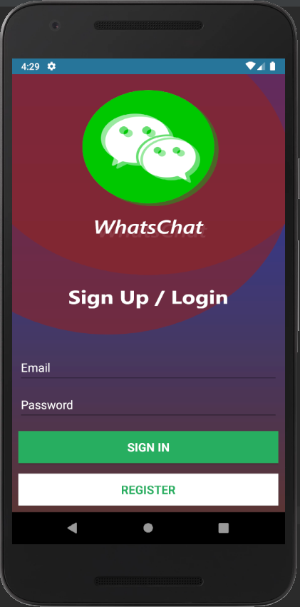
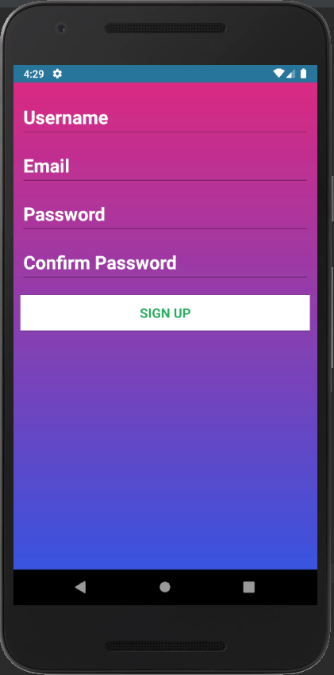
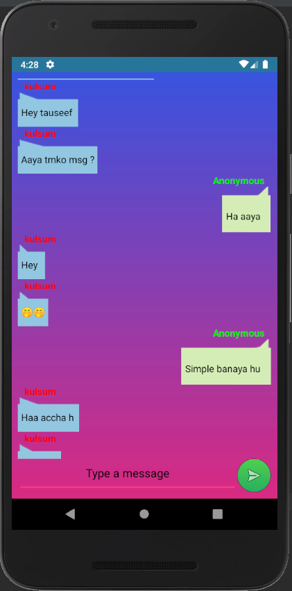

# WhatsChat
> WhatsApp like chat system basic material UI design and basic chat functionality

## Introduction
WhatsChat is a chat application developed for practice purpose with Firebase Realtime Database in backend

## Snapshot of the project

## Requirements
* Realtime Database [Firebase](http://firebase.google.com/)
* Install [Android Studion](https://developer.android.com/studio)
* Firebase Authentication or User Authentication using Database [Firebase](http://firebase.google.com/) (Optional)
